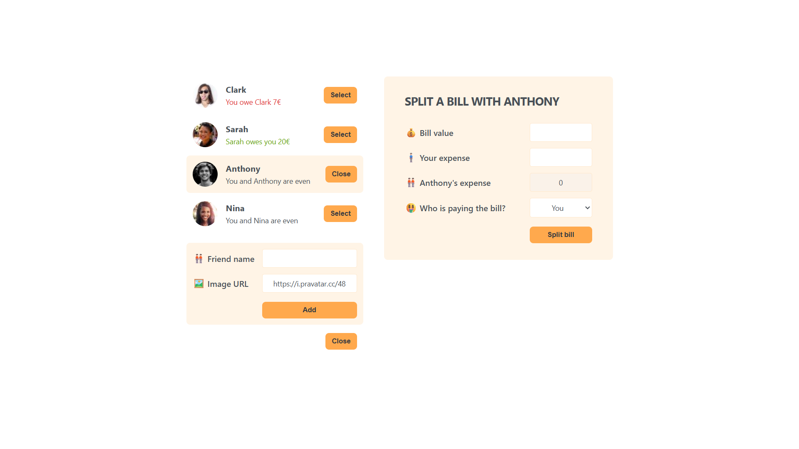

## 💸 Split the Bill App

A dynamic React-based app for tracking friends' balances and effortlessly splitting bills—add friends, select who owes what, and watch the math handle the rest. 
This project was built to practice React fundamentals like controlled forms, state updates, and dynamic UI interactions.

🔗 **[Click here to view the live project](https://bahareh-bahrami.github.io/Eat-N-Split/)** 
 

---

### 🚀 Features

- Add and display friends with custom profile images
- Select a friend to view or update your shared balance
- Split bills easily by entering amounts and selecting who paid
- View color-coded balances (green: owes you, red: you owe)
- Clear, intuitive UI with conditional rendering and feedback

---

### 🛠️ Technologies Used

- **React.js** (functional components + hooks like <code>useState</code>)
- **JavaScript (ES6+)**
- **CSS3** (Flexbox, Grid)
- **Git & GitHub Pages** (version control and deployment)

---

### 📚 What I Learned

- Managing shared and component-level state in using <code>useState</code>
- Building reusable components and passing props effectively
- Handling multiple controlled forms and managing user input
- Using conditional rendering and dynamic class names for UI feedback
- Structuring scalable React apps with clear data flow between components

---

